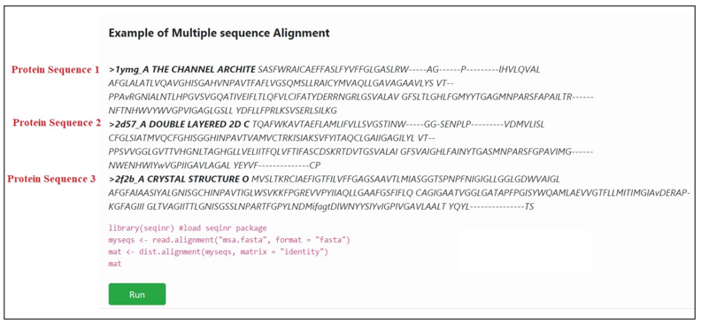

**Procedure to work simulator**
 
1.	Consider three random protein sequences: Protein Sequence 1, Protein Sequence 2, Protein Sequence 3. 

 &nbsp;

.fasta format aminoacid sequences were aligned using multiple sequence alignment with sequinR package. The dist.alignment() function takes a multiple alignment as input and calculates calculates the genetic distance between each pair of proteins in the multiple alignment.
&nbsp;

2.	Click on run button to execute simulator. 

 &nbsp;
 
 The numerical values in matrix of the output indicates genetic distance between each pair of proteins in the multiple alignment. The larger the genetic distance between two sequences, the more amino acid changes or indels that have occurred since they shared a common ancestor, and the longer ago their common ancestor probably lived. 

 &nbsp;

  **DIY**

 &nbsp;

1. Follow ( https://vlab.amrita.edu/index.php?sub=3&brch=311&sim=1835&cnt=2) to install R in personal computer.

2. Install the SeqinR package.
   
   Import “seqinr” library to R workspace

3. Create a function() for retrieving multiple sequence from database

    Function 1
		    
        create a list to store sequences

		connect to the database

		for each element in the array query the sequence and assign to a variable 
			
        append the data into a list
		    
        end
		    
        close the connection
		    
        return list

	    end of fuction 1

4. Create a vector of sequences

5. Retrieve the sequences from the database

6. Write the sequences into a file
                    
7. Align the sequence and assign to a variable in phylip format
