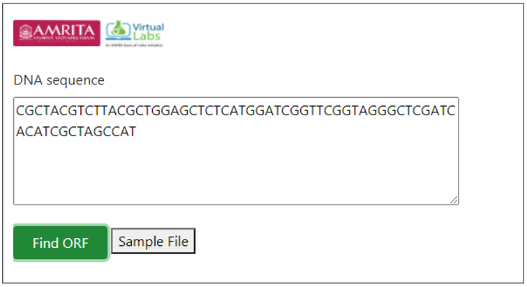

**Procedure to Work Simulator**
 

* 1.  Provide a DNA sequence in user interface for finding ORF. For example provide a hypothetical sequence 
CGCTACGTCTTACGCTGGAGCTCTCATGGATCGGTTCGGTAGGGCTCGATCACATCGCTAGCCAT

    

* 2.	Click on Find ORF tab for executing simulator.

* 3.	A default sequence file is provided in the user interface. User can download the file and can use the file as query sequence for finding ORF.

ORF is a continuous stretch of codons with a start codon usually AUG and with a stop codons usually UAA, UAG or UGA.

&ensp;

**DIY**

&ensp;

Import “stringr” library to R workspace

                library("stringr")

&nbsp;

Create function for finding Start and Stop codon

                findPotentialStartsAndStops<- function(sequence)
                    {

&nbsp;

Define a vector with the sequences of potential start and stop codons

                    codons<- c("atg", "taa", "tag", "tga")
                    
&nbsp;

Find the number of occurrences of each type of potential start or stop codon

                        for (i in 1:4)
                        {   
                            codon<- codons[i]
    
&nbsp;

Find all occurrences of codon "codon" in sequence "sequence"
            
                    occurrences<- as.data.frame(str_locate_all(sequence,codon))

Find the start positions of all occurrences of "codon" in sequence "sequence"

                    codonpositions<- c(occurrences[[1]])
 
&nbsp;

Find the total number of potential start and stop codons in sequence "sequence"
        
                    numoccurrences<- length(codonpositions)
                        if (i == 1)
                        {
      

&nbsp;

Make a copy of vector "codonpositions" called "positions"
    
                        positions<- codonpositions
      
&nbsp;

Make a vector "types" containing "numoccurrences" copies of "codon"

                types<- rep(codon, numoccurrences)
                }
                else
                    {
      

&nbsp;

Add the vector "codonpositions" to the end of vector "positions":

                positions<- append(positions, codonpositions,after=length(positions))
      

&nbsp;

Add the vector "rep(codon, numoccurrences)" to the end of vector "types":
    
            types<- append(types, rep(codon, numoccurrences),after=length(types))
            }
            }

&nbsp;

Sort the vectors "positions" and "types" in order of position along the input sequence:

            indices<- order(positions)
            positions<- positions[indices]
            types<- types[indices]
  

&nbsp;

Return a list variable including vectors "positions" and "types":

            mylist<- list(positions,types)
            return(mylist)
            }

            findORFsinSeq<- function(sequence)
            {
            require(Biostrings)

  

&nbsp;

Make vectors "positions" and "types" containing information on the positions of ATGs in the sequence:

            mylist<- findPotentialStartsAndStops(sequence)
            positions<- mylist[[1]]
            types<- mylist[[2]]

Make vectors "orfstarts" and "orfstops" to store the predicted start and stop codons of ORFs
    
            orfstarts<- numeric()
            orfstops<- numeric()

&nbsp;

Make a vector "orflengths" to store the lengths of the ORFs

            orflengths<- numeric()
  
&nbsp;

Print out the positions of ORFs in the sequence:
Find the length of vector "positions"

            numpositions<- length(positions)

&nbsp;

There must be at least one start codon and one stop codon to have an ORF.

        if (numpositions>= 2){
        for (i in 1:(numpositions-1))
        {
        posi<- positions[i]
        typei<- types[i]
        found<- 0
        while (found == 0)
        {   
        for (j in (i+1):numpositions)
        {
        posj<- positions[j]
        typej<- types[j]
        posdiff<- posj - posi
        posdiffmod3 <- posdiff %% 3
          

&nbsp;

Add in the length of the stop codon

        orflength<- posj - posi + 3
        if (typei == "atg" && (typej == "taa" || typej == "tag" || typej== "tga") && posdiffmod3 == 0)
          {
        
        

&nbsp;

Check if we have already used the stop codon at posj+2 in an ORF
        numorfs<- length(orfstops)
        usedstop<- -1
        if (numorfs> 0)
            {
        for (k in 1:numorfs)
              {
        orfstopk<- orfstops[k]
        if (orfstopk == (posj + 2)) { usedstop<- 1 }
              }
            }
        if (usedstop == -1)
            {
        orfstarts<- append(orfstarts, posi,after=length(orfstarts))
        orfstops<- append(orfstops, posj+2,after=length(orfstops)) # Including the stop codon.
        orflengths<- append(orflengths, orflength,after=length(orflengths))
            }
        found<- 1
        break
          }
        if (j == numpositions) { found <- 1 }
        }
        }
        }
        } 
 
&nbsp;

Sort the final ORFs by start position:

        indices<- order(orfstarts)
        orfstarts<- orfstarts[indices]
        orfstops<- orfstops[indices]

&nbsp;

Find the lengths of the ORFs that we have

        orflengths<- numeric()
        numorfs<- length(orfstarts)
        for (i in 1:numorfs)
         {
            orfstart<- orfstarts[i]
            orfstop<- orfstops[i]
            orflength<- orfstop - orfstart + 1
            orflengths<- append(orflengths,orflength,after=length(orflengths))
             }
            mylist<- list(orfstarts, orfstops, orflengths)
            return(mylist)
            }

