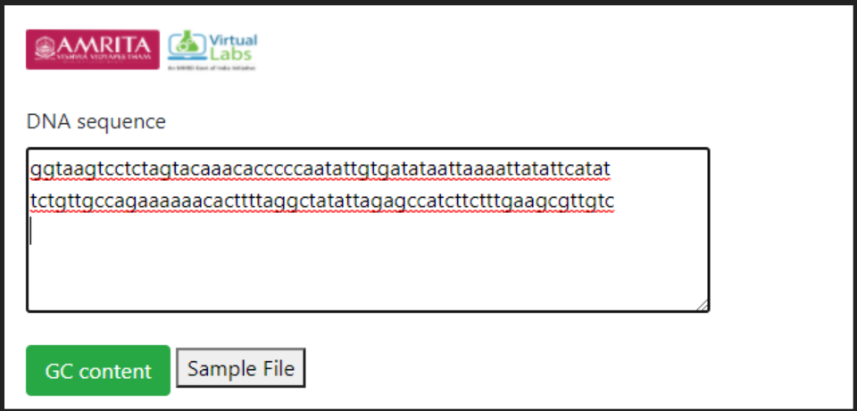
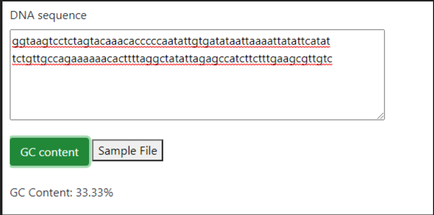

### Procedure to work simulator

1.	Enter a sample DNA sequence in user interface of R platform. For example paste the sequence 
ggtaagtcctctagtacaaacacccccaatattgtgatataattaaaattatattcatattctgttgccagaaaaaacacttttaggctatattagagccatcttctttgaagcgttgtc

&nbsp;

2.	Click on GC content tab for output. 

Here, for the given sequence the GC content is 33.33%. GC content measures indicate the proportion of G and C bases in a sequence including adenine and thymine in DNA and adenine and uracil in RNA.

3.	Also, a default sequence file is provided in the user interface. User can download the file and then choose that file for GC content analysis.  

***Description***
 
*The experiment uses “seqinr” library for finding Guanine-Cytosine (GC) content in R programing. GC content is the ratio of Guanine-Cytosine in a nucleotide sequence. First line of code is importing the seqinR library into the workspace. The function “s2c” convert the string into an array and assign to a variable named seq1 and the GC( ) function in seqinr library calculates the GC content of the given nucleotide sequence.*
 
&nbsp;

&nbsp;

**Procedure to calculate GC content in a personal computer**

1.	Follow ( https://vlab.amrita.edu/index.php?sub=3&brch=311&sim=1835&cnt=2) to install R in personal computer.
2.	Install sequinR package. Follow the code 

        install.packages('seqinr')
        library('seqinr')
3. Follow the code in the command window:

               library("seqinr")
               seq1<-s2c("atgcttaaagctagctagggcatggcatggctaggctatggagactgactacg")
               GC(seq1)
4. Click execute button for output.
 
&nbsp; 

