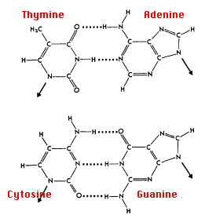

 &nbsp;
 
 DNA sequences are the blueprint of genetic information consists of two strands that are complementary to each other and the strands are made of up four bases: adenine (A), cytosine (C), guanine (G), and thymine (T). Interesting feature of DNA is complementarity between nitrogen bases.  Adenine always pairs with thymine to form a base pair with 2 hydrogen bonds (A=T), while Guanine pairs with the complementary Cytosine to form a base pair with three hydrogen bonds (G ≡ C).  In a double stranded DNA, the frequency of Adenine and guanine on a single strand is approximately similar to Thymine and Cytosine on the same strand.  In this way, DNA double strands are formed in accordance with the principle of complementarity. Due to the hydrogen bonding property, A and T forms the weakest bond and G and C forms the strongest bond. These interactions are important in providing thermal stability in higher order structures of DNA and RNA transcripts. 
 
 &nbsp;

 

  &nbsp;
  
  Research community has been widely interested in studying the GC % (Total percentage of GC) of sequence for understanding the statistical significance of a DNA sequence. Studies indicated that genomic base composition (GC content) affect genome functioning and species ecology. GC % is specific feature for specific organisms. Bacteriophage viruses have low GC content as it require rapid denaturation for inserting genome of the bacteria. For thermophilic bacteria, GC content is high to keep their genome stable at very high temperature based environmental condition. 
 
 &nbsp;

**GC Content analysis using R programming**

R programming provides a statistical computing environment for sequence analysis of DNA and protein.  R platform has a sequinR package, which indicates sequences in R.    It is a library which includes utilities to retrieve and analyse biological sequences. It provides an interface between R languages and provides an environment for statistical computing and graphics generation.