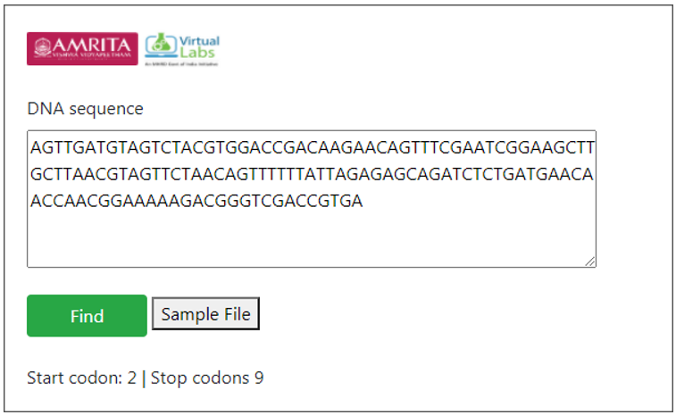

**Procedure to work the simulator**

&nbsp;
1.	Provide a DNA sequence in user interface for finding ORF. For example provide a hypothetical sequence.
 
                AGTTGATGTAGTCTACGTGGACCGACAAGAACAGTTTCGAATCG
                GAAGCTTGCTTAACGTAGTTCTAACAGTTTTTTATTAGAGAGCA
                GATCTCTGATGAACAACCAACGGAAAAAGACGGGTCGACCGTGA

     

2.	Click on Run button to execute simulation.

     

&nbsp;

3.	The number of start codon and stop codons in the given sequence is displayed as result. Start codon indicates the site for initiation of translation into protein sequence and the stop codon indicates the site for terminating translation process. 

&nbsp;
4.	A default sequence file is provided in the user interface. User can download the file and can use the file as query sequence for finding Start and Stop Codons

&nbsp;

The complete genome sequence of the particular organism is displayed as result. 

&nbsp;

