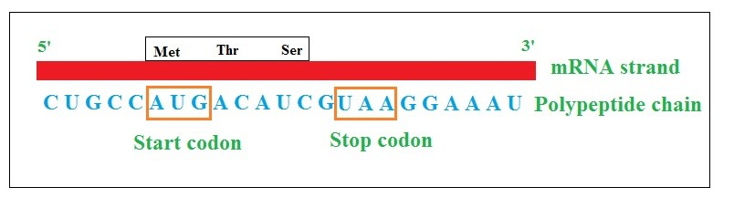

Genes in prokaryotes and eukaryotes were composed of DNA molecule which is linearly arranged on chromosomes. Such genes encode protein molecules that work to carry out the necessary functions of the cell. Such protein-encoding genes specify different amino acids sequences, which are the building blocks of proteins. Replication of DNA, Transcription and Translation are the main processes that were used by cells for maintaining genetic information and for converting the genetic information encoded in the DNA to genetic products such as RNAs, proteins depending on the nature of the gene. Identifying sequence of events in the cells was a major milestone in molecular biology and genetics, thus contributing to central dogma of molecular biology. Process involving in central dogma are transcription and translation. Transcription is the transfer of genetic information in DNA to mRNA that happens in the nucleus of the cell. During transcription, an mRNA strand is made that complementary to DNA strand called gene, which can be easily be identified from the DNA sequence. A gene has three basic regions; promoter, coding sequence and terminator. 

Transcription involves three steps, initiation, elongation, and termination. During initiation step, enzyme RNA polymerase binds to promoter region of the gene. During this DNA strand unwind so that the enzyme can read the bases on the DNA strand. Enzymes make mRNA strand with a complementary base sequence. During elongation step, nucleotides are added to the complementary mRNA strand. During termination phase, RNA polymerase transcribes terminator, and it detaches from DNA. The new strand of mRNA strand is formed in this step. In case of eukaryotes, new mRNA strand is not ready for translation process and it is called as pre-mRNA. The pre-MRA strand needs more processing before leaving from nucleus as mature mRNA. It includes modifications such as adding 5' cap, splicing, editing, and 3' polyadenylation tail, resulting in translating more than one protein from a single gene. 5' cap functions to protect mRNA in the cytoplasm and attaches mRNA with ribosome for initiating translation. During splicing process, introns, the regions that do not code for protein, are removed from the protein coding sequence of mRNA. After splicing, mRNA strand consists only exons that do code for the protein. Editing changes some nucleotide sequences in. mRNA.  Polyadenylation is a process of adding “tail” to the mRNA that consists of a string of adenine bases that signals the end of mRNA strand. It functions to export mRNA from the nucleus, and protects mRNA from enzymes that might damage the strand. 

Translation is a process involving the reading of genetic code in mRNA to make protein with a chain of amino acids known as polypeptides.  When the matured mRNA leaves from the nucleus, it moves to ribosome that consists of rRNA and proteins. These rRNA has peptidyl transferase activity for binding the amino acids and named it as ribozymes. Translation happens in the cytoplasm following transcription and involves three steps: initiation, elongation and termination. Essential factors for carrying out translation are mRNA, ribosomes, and transfer RNA (tRNA). The nucleotide bases of mRNA are read as codons of three bases, each codon codes for specific amino acids. tRNA possess an anticodon complementary to mRNA codon (For example, Aminoacid Lysine is coded by AAG, and the anticodon will be UUC),  and an attached amino acid at the other end. tRNA molecules bringing amino acids to ribosomes in accurate order for assembling polypeptide chains. Single aminoacids were coded by more than one codon and specific codons are needed for the start and the end of translation. Aminoacyl-tRNA synthetases enzymes link amino acids to their corresponding tRNA molecule forming aminoacyl-tRNA complex. 

The ribosome initiate translation, when it finds the start codon, sequence AUG in the mRNA.  AUG codon is a part of slightly larger sequence, Kozak consensus sequence, GCCACCAUGG AUG codes for methionine, hence protein translation initiates with amino acid methionine. The triplet codon sequence determines which amino acid is getting added to the growing protein chain. During the initiation process, small 40s subunit of the ribosome binds to the 5’ cap of mRNA and the larger 60s subunit binds subsequently to complete the initiation complex. Ribosome possesses two tRNA binding sites, P site holding the peptide chain and the A site for accepting the tRNA. During elongation phase, Methionine-tRNA binds to the P site, aminoacyl-tRNA complementary next codon binds to the A site using the energy yielded from GTP hydrolysis. Methionine from P site moves to the A site for binding to new amino acid there, and elongates the peptide chain. tRNA molecules leave the ribosome and the cycle continues for synthesizing peptide chain. The growth of polypeptide is from the N terminal (methionine) to the C terminal (the final amino acid coded). A stop codon is a trinucleotide sequence in mRNA molecule that signals to terminate protein synthesis. When the ribosome encounters a stop codon, or nonsense codon, it falls off from the mRNA, and the polypeptide chain growth is completed. The common variations of stop codons are UGA, UAA, and UAG (Fig.1). The segment of mRNA precedingthe starting point is not translated and is denoted as the 5′ untranslated region (5′ UTR) and mRNA succeeding the stop codon will also not be translated and is known as the 3′ UTR. The polypeptide sequence beginning from start codon to the stop codon is known as an open reading frame.
 

&nbsp;

&nbsp;
Fig.1. Illustration of protein synthesis with start and stop codons
