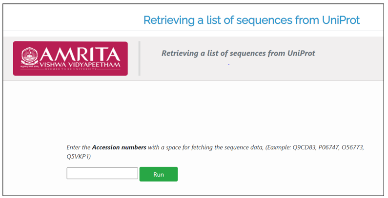
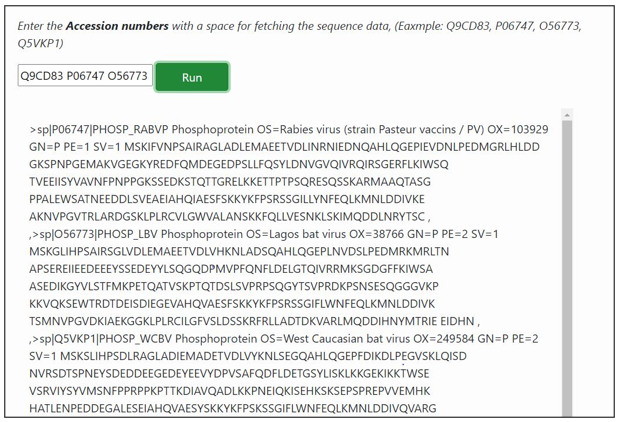

**Procedure to work simulator**
 
1. To retrieve sequence information of a list of proteins, user can enter the known accession number of proteins of interest in the search box. List the accession numbers of proteins with a space in between the accession numbers.

   

 &nbsp;

2.	For example, in this simulator accession numbers of some proteins are given. Q9CD83, P06747, O56773, Q5VKP1).

3.	Provide the sample accession numbers and click on Run button to execute simulation.

   

 &nbsp;
 
4.	The result page displays information of list of proteins related to the query search. 

5.	User can try to run the simulator with other accession numbers Q14533, Q9BYR3, P26371, Q07627, Q3TTY5. 

 &nbsp;

  **DIY**

 &nbsp;
1.	Follow (https://vlab.amrita.edu/index.php?sub=3&brch=311&sim=1835&cnt=2) to install R in personal computer.
2.	Install the SeqinR package.
3.	To load “SeqinR” R package follow > library("seqinr") 
4.	Follow the code in the command window: 

        retrieveseqs<- function(seqnames,acnucdb) #custom function for retrieving multiple sequence from Uniprot
    
        {
        myseqs<- list()
        # Make a list to store the sequences
        require("seqinr") 
        choosebank(acnucdb)
        for (i in 1:length(seqnames))
        {
        seqname<- seqnames[i]
        print(paste("Retrieving sequence",seqname,"..."))
        queryname<- "query2"
        query<- paste("AC=",seqname,sep="")
        query_test<- query(queryname,`query`)
        seq<- getSequence(query_test$req[[1]]) # Makes a vector "seq" containing the sequence
        myseqs[[i]] <- seq
         }
        closebank()
        return(myseqs)
        }
        seqnames<- c("P06747", "P0C569", "O56773", "Q5VKP1")
        seqs<- retrieveseqs(seqnames,"swissprot")
        length(seqs)
        seq1 <- seqs[[1]]
        seq1
        seq2 <- seqs[[2]]
        seq2[1:20]
5.	Click Execute Button for output.    
&nbsp;

