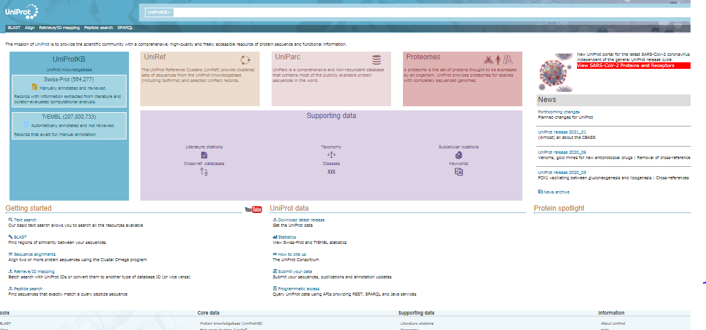

 Understanding the functional properties of proteins was of specific interest in the field of biological sciences. With the advancements in the molecular biology and genomic arena, the genomes that were completely sequenced were increasing day by day. Research communities have been dwelling to identify specific proteins encoded by the genomes. Scientific information regarding the genomes and encoded protein list were updated in multiple locations and biological databases for ease of access to the biological community. UniProt (Universal Protein Resource) provides an up-to-date, comprehensive overview of protein information at a single site which can be accessed o the users using URL http://www.uniprot.org/ (Fig.1).  It has been adapting with user community for data gathering and processing for protein information utilization. UniProt is a consortium of Swiss Institute of Bioinformatics (SIB), the European Bioinformatics Institute (EBI) and the Protein Information Resource (PIR). The key UniProt datasets for searching functionality of data of user’s interest includes UniProt Knowledgebase (UniProtKB), the UniProt Reference Clusters (UniRef), and the UniProt Archive (UniParc). Also set of proteins with completely sequenced genomes (Proteomes) were also provided for fulfilling the requisites of scientific community. UniProtKB, the central access point for extensive curated protein information provides functions of the selected protein, and the UniProtKB entries were available in Flat Text, XML and RDF/XML file formats.  UniRef provides detailed information about genome annotation representing phylogenic relationships of the selected protein sequences.   (UniParc) provides historical aspects of protein sequences and UniMES provides  metagenomics data with reference to Global Ocean Sampling Expedition (GOS) and International Nucleotide Sequence Databases (INSDC). 

In a broader sense, Uniprot has four main tools;

**BLAST** (Basic Local Alignment Search Tool), for finding similarities between the interested protein sequences. This in turn provides detailed overview of functional and evolutionary relationships for identifying the members belonging to the gene families. A link to the BLAST tool page has been given on the header part on pages of Uniprot website. 

‘**Align**’ multiple sequence alignment tools for proteins which runs Clustal Omega algorithm for finding similarity areas in the aligned protein sequences. This provides information regarding conserved residues and regions for inferring functional and evolutionary relationship between the protein sequences. For retrieving complex alignments it is easy to provide the sequences in FASTA format for use with an external alignment tool.

‘**Retrieve/ID Mapping**’ tool for uploading a list of Uniprot identifiers for retrieving batch of corresponding entries from Uniprot database. It helps to map Uniprot identifiers with external databases such as PDB, Refseq, Ensembl where uniprot sequence databases were cross referenced. It maps the sequence of interest which categorizes proteins on the basis of their structure, protein-protein interaction, post translational modification, genome annotation and others. 

‘**Peptide search**’ tool for providing short peptide sequences of minimum of three residues for locating UniProtKB sequences that has exact match with respect to the query sequence. 

&nbsp;

 &nbsp;
 Fig.1. Overview of Uniprot Sequence Database
 
 
 &nbsp;
 
 **Retrieving a list of sequences from UniProt using R**
 
&nbsp;
Retrieving a list of sequences from UniProt using R was designed for easy retrieval of protein sequences, clustering and visualizing of protein data from UniProtKB) using R language. Such packages helps to retrieve proteomics data with limited time and allows the biological science researchers for summarizing the protein information from UniProtKB in a readable excel file or by graphical illustration. Using the R package, it was easy to generate graphical visualization of gene ontology, location of specific chromosome, phylogenic analysis and other physiochemical properties of the specific protein. Like NCBI sequence Uniprot also has RefSeq but the manually annoted information quality in UniProt is greater than that in RefSeq. Accesion numbers were assigned to individual protein sequences in Uniprot database. Another method to retrieve a UniProt protein sequence is by the use of the SeqinR package to query the ACNU sub-database “swissprot”, which contains protein sequences from UniProt.  Use the query () function from SeqinR to query multiple protein sequence

