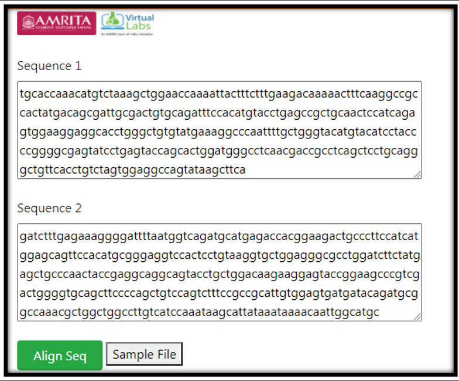

**Procedure to Work Simulator**

1.	User can enter two biological sequence data (query sequence) for finding similarity using pairwise sequence alignment.
For example

Sequence1 : tgcaccaaacatgtctaaagctggaaccaaaattactttctttgaagacaaaaactttcaaggccgccactatgacagcgattgcgactgtgcagatttccacatgtacctgagccgctgcaactccatcagagtggaaggaggcacctgggctgtgtatgaaaggcccaattttgctgggtacatgtacatcctaccccggggcgagtatcctgagtaccagcactggatgggcctcaacgaccgcctcagctcctgcagggctgttcacctgtctagtggaggccagtataagcttca
Sequence 2
gatctttgagaaaggggattttaatggtcagatgcatgagaccacggaagactgcccttccatcatggagcagttccacatgcgggaggtccactcctgtaaggtgctggagggcgcctggatcttctatgagctgcccaactaccgaggcaggcagtacctgctggacaagaaggagtaccggaagcccgtcgactggggtgcagcttccccagctgtccagtctttccgccgcattgtggagtgatgatacagatgcggccaaacgctggctggccttgtcatccaaataagcattataaataaaacaattggcatgc

2.	Click on Align Seq Tab for executing simulator.
3.	The alignment score is given as output. Here, for the given sequence, the alignment score is 20. The alignment score is obtained by calculating the value given to aligned pair of letters and then summing these values over the length of the alignment. Highest score indicates more similar sequences. 
4.	A default sequence file is provided in the user interface. User can download the file and can upload the files for pairwise sequence alignment.

 &ensp;
 **DIY**
 &nbsp;
 
 Follow the command on R platform
                    

        library(Biostrings)
        sigma <- nucleotideSubstitutionMatrix(match = 2, mismatch = -1, baseOnly = TRUE)
        sigma # Print out the matrix
        s1 <- "GAATTC"
        s2 <- "GATTA"
        globalAligns1s2 <- pairwiseAlignment(s1, s2, substitutionMatrix = sigma,gapOpening = -2, gapExtension = -8,          scoreOnly = FALSE)
        globalAligns1s2
 

        
 Follow ( https://vlab.amrita.edu/index.php?sub=3&brch=311&sim=1835&cnt=2) to install R in personal computer.

•	Install the Biostrings package with the commands. 

                        source("http://bioconductor.org/biocLite.R")
                        biocLite("Biostrings")
 &nbsp;
 • Load the package 
                       
                        require(Biostrings)
                        
&nbsp;
