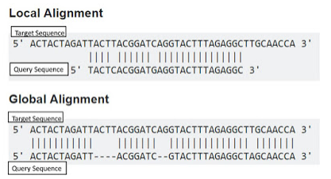
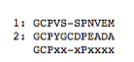
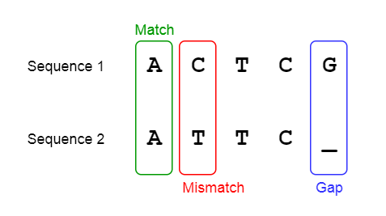

Biological sequences refer to sequences of nucleotides or amino acids. Nucleic acids (DNA and RNA) are polymers composed of four nucleotide bases adenine (A), cytosine (C), guanine (G), and thymine (T) for DNA and Uracil (U) instead of Thymine in RNA. Proteins are polymers composed of sequences of twenty amino acids. Biological sequence analysis methods analyses DNA, RNA and protein sequences by comparing, aligning and indexing with other sequences which is crucial in bioinformatics research. In biology, sequence comparison is essential to understand the evolutionary relationship and prediction of protein structure and function. It forms the basis towards structural and functional analysis of a newly determined sequence. Sequence alignment rely on the fact that all living organisms have a hierarchical origin. In bioinformatics, a sequence alignment implies lining up of biological sequences for retrieving maximal identity level which explains the degree of sequence similarity. Homologous sequences are those which share a common ancestor, so that degree of similarity between two sequences determines the possibility of homology.  Generally there are two types of alignment for biological sequences, local alignment, where only portions of the sequences are aligned and global alignments, where the entire length of the sequences are aligned.

 &nbsp;

 
 &nbsp;

 
**Examples of Global Alignment tools**

EMBOSS Needle, Needleman-Wunch
 

&nbsp;

**Examples of Local alignment tools**

BLAST, EMBOSS Water, LALIGN

&nbsp;

Pairwise sequence alignment methods identify the best-matching global or local alignment of two biological sequences. It has wide biological applications such as genome assembly, where different DNA sequences are putting in back together for creating original chromosome representation from which the DNA originated. Pairwise comparison finds conserved regions between two sequences. Some of the applications of pairwise sequence include
 
1.	 Identification of homologous sequences. 
2.	To find a shared domain in biological sequences.
3.	To find out duplicated regions in protein/nucleic acids.
4.	 Locating important features in amino acids such as , Catalytic domains, Disulphide bridges etc. 
5.	Comparison of a specific gene and its products in a heuristic way. 
6.	 Profile and HMM (Hidden Markov model)making
7.	 Prediction of 3D structure of protein 
8.	Phylogenetic tree analysis

&nbsp;

**Scoring in Pairwise Sequence Alignment**

For analysing a biological sequence, one factor that need to be taken into account is insertion (extra residues in sequence) and deletions (missing residues in sequences). 

&nbsp;

For example, consider the following sequence

 
 

 
 Here in this  two sequence 1 & 2, the identical amino acid residues are marked in the third row by their names (GCP and P), and the position which are different are marked by x. Cysteine in the second sequence does not seem to have a corresponding match in the first sequence which is marked by a dash (-). Percentage of identity is 30% (4/12). Score of alignment is calculated as:

 (Score) S= number of matches - number of mismatches = 4 - 12 =-8

A positive value is given as a match and negative value is given for a mismatch. A gap in sequence alignment determines the residues that have been deleted from the sequence or insertion in the second sequence. 
 
 
 

&nbsp;

**Pairwise sequence alignment of protein or DNA sequences using R programming**
 
There are different pairwise sequence alignment tools such as ACANA, ALLALIGN, SIM, GAP, NAP, LAP etc. to find out the homology between query biological sequence. In this experiment, Biostring package, by Bioconductor project, which is based on  statistical R programming language has been employed. This provides a complete computational and statistical approach for the analysis of different genomic data. Biostring package has string matching algorithms for fast manipulation of large biological sequences.

