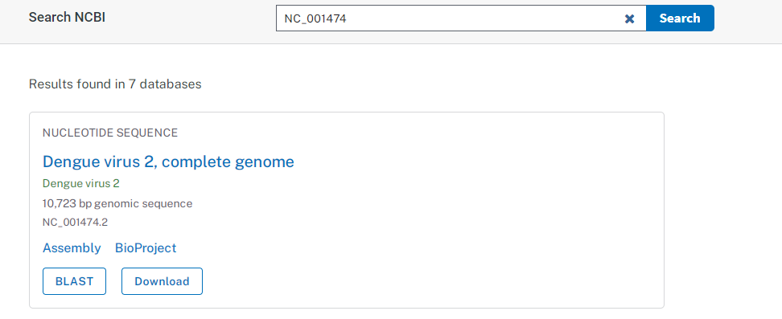
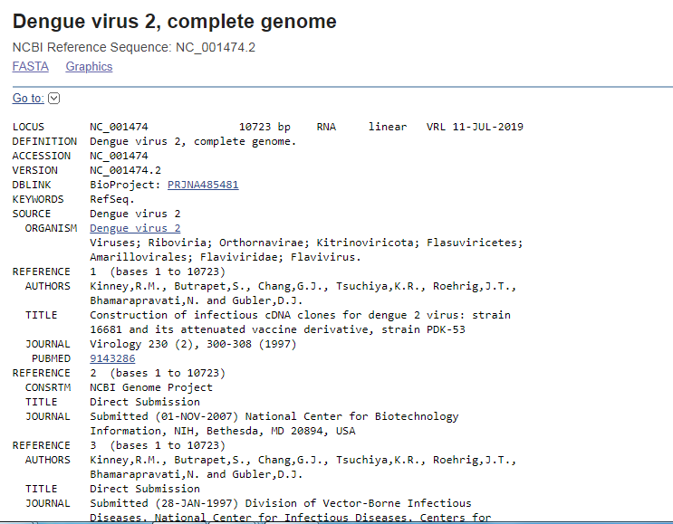
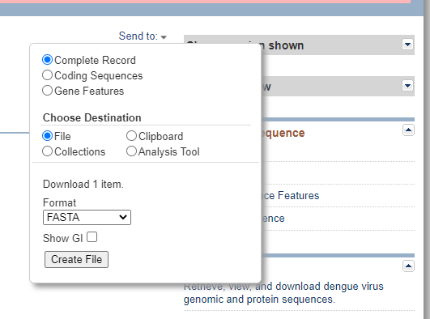

**Introduction**

There has been an increasing demand in biological sciences for deep understanding of biological data that were generated by the human genome project and other sequencing projects.  Bioinformatics, an interdisciplinary field provides tools for computational analysis and interpretation of biological data especially in modern medicine and biology. Using complex computer software programs, DNA and protein sequence data of specific organisms were retrieved and sorted for analysis and predictions by molecular biologists. Pharmaceutical companies were also relying on constant input from bioinformatics experts for acquisition and analysis of biological data for large scale analysis. Biological data from genome projects put forward the need of algorithm software programs for storing the biological data in a usable format. Many databases exist through internet for retrieving information such as DNA sequence of species, genetic mutations and polymorphisms and so on. Understanding biological databases using search engines provide repositories of gene data for identifying and analyzing genetic data for biomedical research. 

&nbsp;

**National Center for Biotechnology Information (NCBI)**

NCBI (https://www.ncbi.nlm.nih.gov/) was developed by National Library of Medicine (NLM) at the National Institutes of Health in 1988 for the purpose of developing information systems for molecular biology. It is a comprehensive website that has databases relevant for biotechnology and biomedicine. It provides retrieval sources for the data in GenBank, a comprehensive database with publicly available nucleotide sequences of various species and other biological data through the NCBI website. GenBank has participation with the European Molecular Biology Lab (EMBL): Nucleotide Sequence Database (EMBL-Bank), and the DNA Data Bank of Japan (DDBJ). Examples of NCBI data resources include Entrez, Pubmed, BLAST, COBALT, the Map Viewer, Gene Expression Omnibus, Molecular Modeling Database and so on, which can be accessed through NCBI homepage. 

&nbsp;

The stipulated roles of NCBI multidisciplinary research includes
1.	Largest repository for biological research data by creating public databases for storage, retrieval, analysis of data related to molecular biology, genetics and biochemistry.
2.	Integrating scientific and medical data with computer-based information processing systems which emphasizes research in computational biology related to structure and function of biological molecules.
3.	Designing algorithms for biological data analysis and cross-referencing mechanisms for genome analysis.
4.	Developing software tools for genome sequence analysis and for disseminating biomedical information.

&nbsp;

**Entrez Databases**
Major goal in databases development was to provide a user friendly access to stored biological data. A wide number of biological retrieval systems exist for genome analysis. Among these, the most popular one is Entrez, an integrated search engine, developed and maintained by NCBI for retrieval of biological data. It allow users for text based searches for nucleotide and protein sequence data, structural information, abstracts, citations, and taxonomic data related to specific query. It integrates information by cross-referencing with NCBI databases on the basis of preexisting and logical relationships between the individual query sequences.

 &nbsp;
 
 **NCBI database in biological sciences**
In NCBI Sequence Database, each sequence has a separate record and a unique identifier which can be used to refer to that sequence record. Unique identifier is recorded as accession, consisting of numbers and letters. For example, accessions for the DNA sequences of the Dengue Virus types are DEN-1 (NC_001477), DEN-2 (NC_001474), DEN-3(NC_001475) and DEN-4 (NC_002640) respectively. For example, to retrieve DNA sequence of DEN-2 virus, potential virus to cause dengue hemorrhagic fever, in NCBI website (https://www.ncbi.nlm.nih.gov/) type “NC_001474 in search box and press the “Search” button. 
 

&nbsp;

 
Fig.1. Querying sequence data for Dengue virus, type 2

&nbsp;

The result page retrives “PubMed” data containing abstracts from scientific papers, Nucleotide database contains DNA and RNA sequence analysis, the “Protein” data contains for retrieving protein sequence data, and so on. User can look into different features of the given query. Instead of providing accession number, users can type query word such as insulin, keratin etc and can search in depth about the query sequence. 
To retrieve FASTA format sequence of DEN-2 Dengue virus genome, click Send” at the top right of the NC_001477 sequence record webpage and choose “File” in FASTA and save the file in “ My documents folder of user’s personal computer as den2.fasta (Fig.2). 

 
 &nbsp;

&nbsp;
 

Fig.2. Retrieving FASTA file of query sequence

&nbsp;

For detailed information see:
http://vlab.amrita.edu/index.php?sub=3&brch=273&sim=1437&cnt=1 

&nbsp;

**Querying genome sequence data using SeqinR**
Apart from retrieving genome sequence from NCBI website, users can retrieve sequence data from NCBI directly from R. With the standard R installation add-ons need to be loaded for running R programming function. SeqinR package helps in retrieving sequences from a DNA sequence database, for carrying out simple DNA sequence analyses.
	
Bioconductor set of R packages (www.bioconductor.org) has packages for R programming for analyzing biological data sets such as microarray data. 
SeqinR package (pbil.univ-lyon1.fr/software/seqinr/home.php?lang=eng) works for retrieving DNA sequences and protein sequence databases, DNA and protein sequences analyses.