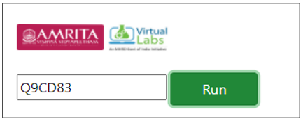
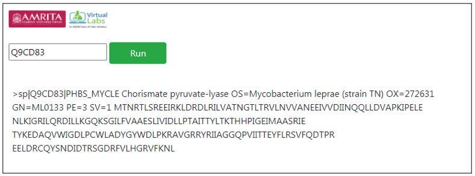

**Procedure to work the simulator**

&nbsp;
1.	Provide Uniprot accession in query box provided in the user interface. For example provide Uniprot accession Q9CD83.

     

&nbsp;

2.	Click on Run button to execute simulation.

     

&nbsp;

3.	Protein sequence information such as name of protein, name of organism and the polypeptide chain related to the query sequence is displayed as result.  

&ensp;

**DIY**

Follow ( https://vlab.amrita.edu/index.php?sub=3&brch=311&sim=1835&cnt=2) to install R in personal computer.

Install the SeqinR package.

To load “SeqinR” R package follow the commands

            > library("seqinr")
            > leprae <- read.fasta(file = "Q9CD83.fasta")
            > ulcerans <- read.fasta(file = "A0PQ23.fasta")
            > lepraeseq <- leprae[[1]]
            > ulceransseq <- ulcerans[[1]]
            > lepraeseq # Display the contents of the vector "lepraeseq" 

